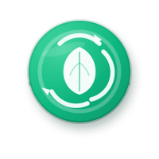

<div align="center">



# EcoHabit

**AI-powered circular economy platform for college students.**

Buy, sell, donate, and recycle products while learning entrepreneurship and sustainability through gamified learning.

---

[](https://flutter.dev)
[](https://nestjs.com)
[](https://fastapi.tiangolo.com)
[](https://www.typescriptlang.org)
[](https://supabase.com)
[](https://firebase.google.com)
[](https://www.tensorflow.org)
[](#license)

</div>

---

## Overview

EcoHabit is a full-stack circular economy platform designed for college campuses. It combines a mobile marketplace with AI-powered waste classification, gamified sustainability rewards, and a complete admin management suite — all built to make recycling, buying, selling, and donating effortless for students.

### What makes it different

- **AI waste scanner** — snap a photo of any item and TensorFlow's MobileNetV2 classifies it with disposal instructions
- **Gamified learning** — earn points, badges, and streaks for sustainable actions
- **Campus marketplace** — buy, sell, donate, and recycle products within your college
- **Admin dashboard** — full web console for user management, report moderation, and audit logging
- **Real-time chat** — in-app messaging between buyers and sellers

---

## Demo

> **Mobile app:** Build and run with `flutter run` — see [Flutter App](#flutter-app) below.
>
> **Admin dashboard:** See [Admin Dashboard](#admin-dashboard) for local setup.
>
> **Landing page:** Open `apps/landing_page/index.html` in any browser.

---

## Tech Stack

| Layer | Technology | Purpose |
|---|---|---|
| **Mobile** | Flutter 3.22 (Dart) | Cross-platform iOS/Android app |
| **Backend API** | NestJS (TypeScript) | REST API, auth, admin logic |
| **AI Service** | FastAPI (Python) | Waste classification, image analysis |
| **ML Model** | TensorFlow (MobileNetV2) | Real-time waste item classification |
| **Database** | Supabase (PostgreSQL) | User data, posts, listings, messages |
| **Auth** | Firebase Authentication | Google + email sign-in, ID tokens |
| **Storage** | Supabase Storage | User uploads, post images, avatars |
| **Caching** | Redis | Session cache, rate limiting |
| **Web Dashboard** | Next.js 16 + Tailwind v4 | Admin console (TypeScript) |
| **Landing Page** | HTML + CSS + JS | Marketing site |

---

## Project Structure

```
EcoHabbit/
├── apps/
│   ├── mobile_app/              # Flutter mobile app
│   ├── admin_dashboard/         # Next.js admin web console
│   └── landing_page/            # Marketing site (HTML)
├── services/
│   ├── backend_api/             # NestJS REST API
│   └── ai_service/              # FastAPI AI/ML service
├── packages/
│   ├── shared_models/           # Shared data models
│   ├── shared_utils/            # Shared utilities
│   └── shared_ui/               # Shared UI components (V2)
├── supabase/
│   └── migrations/              # Database migrations
├── docs/                        # Full project documentation
├── scripts/                     # Build/deploy scripts
├── assets/                      # Static assets
├── docker-compose.yml           # Redis + local dev
└── .github/                     # CI/CD workflows
```

---

## Apps at a Glance

| App | Path | Stack | Description |
|---|---|---|---|
| [**Mobile App**](#flutter-app) | `apps/mobile_app/` | Flutter + Dart | Cross-platform marketplace with AI scanner, chat, gamification |
| [**Admin Dashboard**](#admin-dashboard) | `apps/admin_dashboard/` | Next.js + TS | Web console for user/report/audit management |
| [**Landing Page**](#landing-page) | `apps/landing_page/` | HTML + CSS | Marketing site with feature showcase |

---

## Getting Started

### Prerequisites

| Requirement | Version | Purpose |
|---|---|---|
| [Node.js](https://nodejs.org) | 20+ | Backend + dashboard runtime |
| [Python](https://python.org) | 3.11+ | AI service |
| [Flutter](https://flutter.dev) | 3.22+ | Mobile app |
| [Docker](https://docker.com) | Latest | Redis (optional) |
| [Firebase account](https://console.firebase.google.com) | — | Authentication |
| [Supabase account](https://supabase.com) | — | Database + storage |

### Backend API

```bash
cd services/backend_api
npm install
cp .env.example .env      # Fill in Firebase + Supabase values
npm run start:dev         # http://localhost:3001
```

### AI Service

```bash
cd services/ai_service
python -m venv venv
source venv/bin/activate   # Windows: venv\Scripts\activate
pip install -r requirements.txt
cp .env.example .env       # Fill in values
uvicorn app.main:app --reload  # http://localhost:8000
```

### Flutter App

```bash
cd apps/mobile_app
flutter pub get
flutter run
```

### Admin Dashboard

```bash
cd apps/admin_dashboard
npm install
cp .env.example .env.local   # Fill in Firebase web app values
npm run dev                  # http://localhost:3000
```

See the [Admin Dashboard README](apps/admin_dashboard/README.md) for full setup details including Firebase web app registration.

### Landing Page

Open directly in a browser:

```bash
# No build step needed — just open the file
start apps/landing_page/index.html    # Windows
open apps/landing_page/index.html     # macOS
```

### Docker (Redis)

```bash
docker-compose up -d
```

---

## Documentation

Full project documentation lives in `docs/`:

| Document | Description |
|---|---|
| [`02_PRD.md`](docs/02_PRD.md) | Product Requirements |
| [`03_User_Personas.md`](docs/03_User_Personas.md) | User Personas |
| [`04_User_Journeys.md`](docs/04_User_Journeys.md) | User Journeys |
| [`05_Information_Architecture.md`](docs/05_Information_Architecture.md) | Information Architecture |
| [`08_Database_Design.md`](docs/08_Database_Design.md) | Database Design |
| [`09_API_Specification.md`](docs/09_API_Specification.md) | API Specification |
| [`10_System_Architecture.md`](docs/10_System_Architecture.md) | System Architecture |
| [`11_AI_Architecture.md`](docs/11_AI_Architecture.md) | AI Architecture |
| [`12_Development_Setup.md`](docs/12_Development_Setup.md) | Development Setup |
| [`13_Testing_Strategy.md`](docs/13_Testing_Strategy.md) | Testing Strategy |
| [`14_Deployment_Guide.md`](docs/14_Deployment_Guide.md) | Deployment Guide |
| [`15_Brand_Identity.md`](docs/15_Brand_Identity.md) | Brand Identity |
| [`16_Design_System.md`](docs/16_Design_System.md) | Design System |
| [`17_Screen_Specifications.md`](docs/17_Screen_Specifications.md) | Screen Specifications |
| [`18_Responsive_Design.md`](docs/18_Responsive_Design.md) | Responsive Design |
| [`19_Accessibility_Specification.md`](docs/19_Accessibility_Specification.md) | Accessibility |
| [`20_FR_Traceability.md`](docs/20_FR_Traceability.md) | FR Traceability |

---

## Git Workflow

| Branch | Purpose |
|---|---|
| `main` | Production-ready code |
| `develop` | Development integration branch |
| `feature/*` | Feature branches |
| `bugfix/*` | Bug fix branches |
| `hotfix/*` | Hot fix branches |

### Commit convention

Follow [Conventional Commits](https://www.conventionalcommits.org/):

```
feat(mobile): add marketplace search filter
fix(backend): correct auth token refresh on 401
docs(dashboard): update admin API reference
```

---

## Contributing

1. Fork the repository
2. Create a feature branch from `main`
3. Make your changes following the conventions below
4. Ensure all lints pass:
   - **Backend:** `cd services/backend_api && npm test`
   - **Dashboard:** `cd apps/admin_dashboard && npm run lint && npm run build`
   - **Mobile:** `cd apps/mobile_app && flutter analyze`
5. Open a Pull Request with a clear description

### Code style

- **TypeScript:** Strict mode, no `any`, functional components with hooks
- **Dart/Flutter:** `flutter analyze` with zero warnings
- **Python:** Type hints, docstrings on public functions
- **Tailwind CSS v4:** Utility-first, no inline styles

---

## License

This project is licensed under the [MIT License](LICENSE).

---

<div align="center">

**Built with care for a sustainable future.**

[Flutter App](apps/mobile_app/) · [Admin Dashboard](apps/admin_dashboard/) · [Backend API](services/backend_api/) · [AI Service](services/ai_service/) · [Landing Page](apps/landing_page/) · [Documentation](docs/)

</div>
