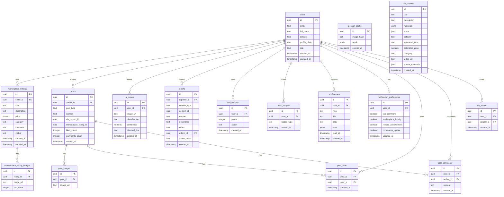

# EcoHabit — Database Design

**Document Reference**: PRD v1.0, Section 13.5
**Last Updated**: July 2026
**Status**: Draft

---

## Overview

- **Database**: Supabase PostgreSQL
- **Naming Convention**: snake_case for tables and columns
- **Primary Keys**: UUID (gen_random_uuid())
- **Timestamps**: created_at, updated_at on all tables
- **Soft Deletes**: status field (active/removed) instead of DELETE

---

## ER Diagram (ASCII)

```
┌─────────────────────────────────────────────────────────────────────────────┐
│                            EcoHabit Database                                │
└─────────────────────────────────────────────────────────────────────────────┘

┌──────────────┐       ┌──────────────────┐       ┌──────────────────┐
│    users     │       │ marketplace_     │       │ marketplace_     │
│──────────────│       │ listings         │       │ listing_images   │
│ id (PK)      │◄──┐   │──────────────────│◄──┐   │──────────────────│
│ email        │   │   │ id (PK)          │   │   │ id (PK)          │
│ full_name    │   │   │ seller_id (FK)───│───┘   │ listing_id (FK)──│──┐
│ college      │   │   │ title            │       │ image_url        │  │
│ profile_photo│   │   │ description      │       │ sort_order       │  │
│ role         │   │   │ price            │       └──────────────────┘  │
│ created_at   │   │   │ category         │                             │
│ updated_at   │   │   │ condition        │                             │
└──────────────┘   │   │ status           │                             │
       │           │   │ created_at       │                             │
       │           │   │ updated_at       │                             │
       │           │   └──────────────────┘                             │
       │           │                                                     │
       │           │   ┌──────────────────┐       ┌──────────────────┐  │
       │           │   │ ai_scans         │       │ diy_projects     │  │
       │           │   │──────────────────│       │──────────────────│  │
       │           │   │ id (PK)          │       │ id (PK)          │  │
       │           └───│ user_id (FK)     │       │ title            │  │
       │               │ image_url        │       │ description      │  │
       │               │ classification   │       │ materials (json) │  │
       │               │ confidence       │       │ steps (json)     │  │
       │               │ disposal_tips    │       │ difficulty       │  │
       │               │ created_at       │       │ estimated_time   │  │
       │               └──────────────────│       │ estimated_price  │  │
       │                                  │       │ category         │  │
       │               ┌──────────────────│       │ video_url        │  │
       │               │ ai_scan_cache    │       │ source_materials │  │
       │               │──────────────────│       │ created_at       │  │
       │               │ id (PK)          │       └──────────────────┘  │
       │               │ image_hash       │                             │
       │               │ result (json)    │                             │
       │               │ expires_at       │                             │
       │               └──────────────────┘                             │
       │                                                                │
       │               ┌──────────────────┐       ┌──────────────────┐  │
       │               │ posts            │       │ post_images      │  │
       │               │──────────────────│       │──────────────────│  │
       └───────────────│ author_id (FK)   │◄──────│ post_id (FK)     │  │
                       │ id (PK)          │       │ id (PK)          │  │
                       │ post_type        │       │ image_url        │  │
                       │ content          │       └──────────────────┘  │
                       │ diy_project_id   │                             │
                       │ marketplace_     │                             │
                       │ listing_id       │                             │
                       │ likes_count      │       ┌──────────────────┐  │
                       │ comments_count   │       │ post_likes       │  │
                       │ created_at       │       │──────────────────│  │
                       └──────────────────┘       │ id (PK)          │  │
                              │                   │ post_id (FK)     │  │
                              │                   │ user_id (FK)     │  │
                              │                   │ created_at       │  │
                              │                   └──────────────────┘  │
                              │                                         │
                              │                   ┌──────────────────┐  │
                              │                   │ post_comments    │  │
                              │                   │──────────────────│  │
                              └───────────────────│ post_id (FK)     │  │
                                                  │ id (PK)          │  │
                                                  │ author_id (FK)   │  │
                                                  │ content          │  │
                                                  │ created_at       │  │
                                                  └──────────────────┘  │
                                                                        │
                       ┌──────────────────┐       ┌──────────────────┐  │
                       │ reports          │       │ eco_rewards      │  │
                       │──────────────────│       │──────────────────│  │
                       │ id (PK)          │       │ id (PK)          │  │
                       │ reporter_id (FK) │       │ user_id (FK)     │  │
                       │ content_type     │       │ points           │  │
                       │ content_id       │       │ action           │  │
                       │ reason           │       │ created_at       │  │
                       │ description      │       └──────────────────┘  │
                       │ status           │                             │
                       │ admin_id (FK)    │       ┌──────────────────┐  │
                       │ action_taken     │       │ user_badges      │  │
                       │ created_at       │       │──────────────────│  │
                       └──────────────────┘       │ id (PK)          │  │
                                                  │ user_id (FK)     │  │
                                                  │ badge_type       │  │
                                                  │ earned_at        │  │
                                                  └──────────────────┘  │
                                                                        │
                       ┌──────────────────┐       ┌──────────────────┐  │
                       │ notifications    │       │ notification_    │  │
                       │──────────────────│       │ preferences      │  │
                       │ id (PK)          │       │──────────────────│  │
                       │ user_id (FK)     │       │ id (PK)          │  │
                       │ type             │       │ user_id (FK)     │  │
                       │ title            │       │ like_comment     │  │
                       │ body             │       │ marketplace_     │  │
                       │ data (json)      │       │ inquiry          │  │
                       │ read_at          │       │ reward_          │  │
                       │ created_at       │       │ achievement      │  │
                       └──────────────────┘       │ community_update │  │
                                                  │ updated_at       │  │
                                                  └──────────────────┘  │
                                                                        │
                       ┌──────────────────┐                             │
                       │ diy_saved        │                             │
                       │──────────────────│                             │
                       │ id (PK)          │                             │
                       │ user_id (FK)     │                             │
                       │ project_id (FK)──│─────────────────────────────┘
                       │ created_at       │
                       └──────────────────┘
```

---

## ER Diagram (Mermaid)



---

## Table Definitions

### users

| Column | Type | Constraints | Description |
|---|---|---|---|
| id | uuid | PK, default gen_random_uuid() | User ID |
| email | text | UNIQUE, NOT NULL | Email address |
| full_name | text | NOT NULL | Full name |
| college | text | NOT NULL | College/university name |
| profile_photo | text | | Profile photo URL |
| role | user_role | NOT NULL, default 'student' | User role |
| created_at | timestamp | NOT NULL, default now() | Account creation time |
| updated_at | timestamp | NOT NULL, default now() | Last update time |

**Indexes**:
- `idx_users_email` on (email)
- `idx_users_role` on (role)
- `idx_users_college` on (college)

---

### marketplace_listings

| Column | Type | Constraints | Description |
|---|---|---|---|
| id | uuid | PK, default gen_random_uuid() | Listing ID |
| seller_id | uuid | FK → users(id), NOT NULL | Seller reference |
| title | text | NOT NULL | Listing title |
| description | text | NOT NULL | Listing description |
| price | numeric | NOT NULL, CHECK (price >= 0) | Price in INR |
| category | product_category | NOT NULL | Category |
| condition | product_condition | NOT NULL | Item condition |
| status | marketplace_listing_status | NOT NULL, default 'active' | Listing status |
| created_at | timestamp | NOT NULL, default now() | Creation time |
| updated_at | timestamp | NOT NULL, default now() | Last update time |

**Indexes**:
- `idx_listings_seller` on (seller_id)
- `idx_listings_category` on (category)
- `idx_listings_status` on (status)
- `idx_listings_price` on (price)
- `idx_listings_created` on (created_at DESC)

---

### marketplace_listing_images

| Column | Type | Constraints | Description |
|---|---|---|---|
| id | uuid | PK, default gen_random_uuid() | Image ID |
| listing_id | uuid | FK → marketplace_listings(id), NOT NULL | Listing reference |
| image_url | text | NOT NULL | Image URL |
| sort_order | integer | NOT NULL, default 0 | Display order |

**Indexes**:
- `idx_listing_images_listing` on (listing_id)

---

### ai_scans

| Column | Type | Constraints | Description |
|---|---|---|---|
| id | uuid | PK, default gen_random_uuid() | Scan ID |
| user_id | uuid | FK → users(id), NOT NULL | User reference |
| image_url | text | NOT NULL | Scanned image URL |
| classification | waste_category | NOT NULL | Waste category |
| confidence | numeric | NOT NULL | Confidence score (0-1) |
| disposal_tips | text | | Disposal suggestions |
| created_at | timestamp | NOT NULL, default now() | Scan time |

**Indexes**:
- `idx_scans_user` on (user_id)
- `idx_scans_created` on (created_at DESC)

---

### ai_scan_cache

| Column | Type | Constraints | Description |
|---|---|---|---|
| id | uuid | PK, default gen_random_uuid() | Cache ID |
| image_hash | text | UNIQUE, NOT NULL | Image content hash |
| result | jsonb | NOT NULL | Cached classification result |
| expires_at | timestamp | NOT NULL | Cache expiration |

**Indexes**:
- `idx_cache_hash` on (image_hash)
- `idx_cache_expires` on (expires_at)

---

### diy_projects

| Column | Type | Constraints | Description |
|---|---|---|---|
| id | uuid | PK, default gen_random_uuid() | Project ID |
| title | text | NOT NULL | Project title |
| description | text | NOT NULL | Project description |
| materials | jsonb | NOT NULL | Required materials |
| steps | jsonb | NOT NULL | Step-by-step instructions |
| difficulty | difficulty_level | NOT NULL | Difficulty level |
| estimated_time | text | NOT NULL | Estimated completion time |
| estimated_price | numeric | NOT NULL | Estimated selling price |
| category | text | NOT NULL | Project category |
| video_url | text | | YouTube tutorial URL |
| source_materials | jsonb | | Waste categories used |
| images | jsonb | | Project images (array of URLs) |
| created_at | timestamp | NOT NULL, default now() | Creation time |

**Indexes**:
- `idx_diy_category` on (category)
- `idx_diy_difficulty` on (difficulty)

---

### diy_saved

| Column | Type | Constraints | Description |
|---|---|---|---|
| id | uuid | PK, default gen_random_uuid() | Save ID |
| user_id | uuid | FK → users(id), NOT NULL | User reference |
| project_id | uuid | FK → diy_projects(id), NOT NULL | Project reference |
| created_at | timestamp | NOT NULL, default now() | Save time |

**Constraints**:
- UNIQUE (user_id, project_id)

**Indexes**:
- `idx_diy_saved_user` on (user_id)

---

### posts

| Column | Type | Constraints | Description |
|---|---|---|---|
| id | uuid | PK, default gen_random_uuid() | Post ID |
| author_id | uuid | FK → users(id), NOT NULL | Author reference |
| post_type | post_type | NOT NULL | Post type |
| content | text | NOT NULL | Post content |
| diy_project_id | uuid | FK → diy_projects(id) | Linked DIY project |
| marketplace_listing_id | uuid | FK → marketplace_listings(id) | Linked listing |
| likes_count | integer | NOT NULL, default 0 | Like count |
| comments_count | integer | NOT NULL, default 0 | Comment count |
| created_at | timestamp | NOT NULL, default now() | Creation time |

**Indexes**:
- `idx_posts_author` on (author_id)
- `idx_posts_type` on (post_type)
- `idx_posts_created` on (created_at DESC)

---

### post_images

| Column | Type | Constraints | Description |
|---|---|---|---|
| id | uuid | PK, default gen_random_uuid() | Image ID |
| post_id | uuid | FK → posts(id), NOT NULL | Post reference |
| image_url | text | NOT NULL | Image URL |

**Indexes**:
- `idx_post_images_post` on (post_id)

---

### post_likes

| Column | Type | Constraints | Description |
|---|---|---|---|
| id | uuid | PK, default gen_random_uuid() | Like ID |
| post_id | uuid | FK → posts(id), NOT NULL | Post reference |
| user_id | uuid | FK → users(id), NOT NULL | User reference |
| created_at | timestamp | NOT NULL, default now() | Like time |

**Constraints**:
- UNIQUE (post_id, user_id)

**Indexes**:
- `idx_post_likes_post` on (post_id)
- `idx_post_likes_user` on (user_id)

---

### post_comments

| Column | Type | Constraints | Description |
|---|---|---|---|
| id | uuid | PK, default gen_random_uuid() | Comment ID |
| post_id | uuid | FK → posts(id), NOT NULL | Post reference |
| author_id | uuid | FK → users(id), NOT NULL | Author reference |
| content | text | NOT NULL | Comment content |
| created_at | timestamp | NOT NULL, default now() | Comment time |

**Indexes**:
- `idx_post_comments_post` on (post_id)
- `idx_post_comments_author` on (author_id)

---

### reports

| Column | Type | Constraints | Description |
|---|---|---|---|
| id | uuid | PK, default gen_random_uuid() | Report ID |
| reporter_id | uuid | FK → users(id), NOT NULL | Reporter reference |
| content_type | text | NOT NULL | marketplace_listing/post/comment |
| content_id | uuid | NOT NULL | Reported content ID |
| reason | report_reason | NOT NULL | Report reason |
| description | text | | Additional details |
| status | report_status | NOT NULL, default 'pending' | Report status |
| admin_id | uuid | FK → users(id) | Reviewing admin |
| action_taken | text | | Action description |
| created_at | timestamp | NOT NULL, default now() | Report time |

**Indexes**:
- `idx_reports_status` on (status)
- `idx_reports_content` on (content_type, content_id)

---

### eco_rewards

| Column | Type | Constraints | Description |
|---|---|---|---|
| id | uuid | PK, default gen_random_uuid() | Reward ID |
| user_id | uuid | FK → users(id), NOT NULL | User reference |
| points | integer | NOT NULL | Points awarded |
| action | text | NOT NULL | Action that earned points |
| created_at | timestamp | NOT NULL, default now() | Action time |

**Indexes**:
- `idx_rewards_user` on (user_id)
- `idx_rewards_created` on (created_at DESC)

---

### user_badges

| Column | Type | Constraints | Description |
|---|---|---|---|
| id | uuid | PK, default gen_random_uuid() | Badge ID |
| user_id | uuid | FK → users(id), NOT NULL | User reference |
| badge_type | badge_type | NOT NULL | Badge type |
| earned_at | timestamp | NOT NULL, default now() | Earn time |

**Constraints**:
- UNIQUE (user_id, badge_type)

**Indexes**:
- `idx_badges_user` on (user_id)

---

### notifications

| Column | Type | Constraints | Description |
|---|---|---|---|
| id | uuid | PK, default gen_random_uuid() | Notification ID |
| user_id | uuid | FK → users(id), NOT NULL | User reference |
| type | notification_type | NOT NULL | Notification type |
| title | text | NOT NULL | Notification title |
| body | text | NOT NULL | Notification body |
| data | jsonb | | Additional data |
| read_at | timestamp | | Read time |
| created_at | timestamp | NOT NULL, default now() | Creation time |

**Indexes**:
- `idx_notifications_user` on (user_id)
- `idx_notifications_read` on (read_at)
- `idx_notifications_created` on (created_at DESC)

---

### notification_preferences

| Column | Type | Constraints | Description |
|---|---|---|---|
| id | uuid | PK, default gen_random_uuid() | Preference ID |
| user_id | uuid | FK → users(id), UNIQUE, NOT NULL | User reference |
| like_comment | boolean | NOT NULL, default true | Like/comment notifications |
| marketplace_inquiry | boolean | NOT NULL, default true | Marketplace notifications |
| reward_achievement | boolean | NOT NULL, default true | Reward notifications |
| community_update | boolean | NOT NULL, default false | Community notifications |
| updated_at | timestamp | NOT NULL, default now() | Last update time |

---

## Enums (SQL)

```sql
CREATE TYPE user_role AS ENUM ('student', 'ngo', 'organization', 'admin');

CREATE TYPE product_category AS ENUM (
    'textbooks_stationery',
    'electronics_gadgets',
    'furniture_decor',
    'clothing_accessories',
    'sports_fitness',
    'others'
);

CREATE TYPE product_condition AS ENUM ('new', 'good', 'fair', 'used');

CREATE TYPE marketplace_listing_status AS ENUM ('active', 'sold', 'removed');

CREATE TYPE transaction_type AS ENUM ('buy', 'sell', 'rent', 'exchange');

CREATE TYPE post_type AS ENUM ('diy', 'tip', 'marketplace');

CREATE TYPE report_reason AS ENUM ('spam', 'inappropriate', 'scam', 'other');

CREATE TYPE report_status AS ENUM ('pending', 'resolved', 'dismissed');

CREATE TYPE badge_type AS ENUM (
    'first_sale',
    'recycler',
    'creator',
    'community_star',
    'campus_champion',
    'eco_warrior'
);

CREATE TYPE notification_type AS ENUM (
    'like_comment',
    'marketplace_inquiry',
    'reward_achievement',
    'community_update'
);

CREATE TYPE waste_category AS ENUM (
    'plastic',
    'paper_cardboard',
    'glass',
    'metal',
    'organic',
    'ewaste',
    'textile',
    'others'
);

CREATE TYPE difficulty_level AS ENUM ('easy', 'medium', 'hard');
```

---

## Row-Level Security (RLS) Policies

### users

```sql
-- Users can read own profile
CREATE POLICY users_read_own ON users
    FOR SELECT USING (auth.uid() = id);

-- Users can update own profile
CREATE POLICY users_update_own ON users
    FOR UPDATE USING (auth.uid() = id);

-- Admins can read all profiles
CREATE POLICY users_admin_read ON users
    FOR SELECT USING (
        EXISTS (
            SELECT 1 FROM users WHERE id = auth.uid() AND role = 'admin'
        )
    );
```

### marketplace_listings

```sql
-- Anyone can read active listings
CREATE POLICY listings_public_read ON marketplace_listings
    FOR SELECT USING (status = 'active');

-- Sellers can CRUD own listings
CREATE POLICY listings_seller_all ON marketplace_listings
    FOR ALL USING (seller_id = auth.uid());

-- Admins can read all listings
CREATE POLICY listings_admin_read ON marketplace_listings
    FOR SELECT USING (
        EXISTS (
            SELECT 1 FROM users WHERE id = auth.uid() AND role = 'admin'
        )
    );
```

### posts

```sql
-- Anyone can read posts
CREATE POLICY posts_public_read ON posts
    FOR SELECT USING (true);

-- Authors can CRUD own posts
CREATE POLICY posts_author_all ON posts
    FOR ALL USING (author_id = auth.uid());

-- Admins can read all posts
CREATE POLICY posts_admin_read ON posts
    FOR SELECT USING (
        EXISTS (
            SELECT 1 FROM users WHERE id = auth.uid() AND role = 'admin'
        )
    );
```

### reports

```sql
-- Users can create reports
CREATE POLICY reports_create ON reports
    FOR INSERT WITH CHECK (reporter_id = auth.uid());

-- Users can read own reports
CREATE POLICY reports_read_own ON reports
    FOR SELECT USING (reporter_id = auth.uid());

-- Admins can read all reports
CREATE POLICY reports_admin_read ON reports
    FOR SELECT USING (
        EXISTS (
            SELECT 1 FROM users WHERE id = auth.uid() AND role = 'admin'
        )
    );

-- Admins can update reports
CREATE POLICY reports_admin_update ON reports
    FOR UPDATE USING (
        EXISTS (
            SELECT 1 FROM users WHERE id = auth.uid() AND role = 'admin'
        )
    );
```

### eco_rewards

```sql
-- Users can read own rewards
CREATE POLICY rewards_read_own ON eco_rewards
    FOR SELECT USING (user_id = auth.uid());

-- System can insert rewards (via function)
CREATE POLICY rewards_insert_system ON eco_rewards
    FOR INSERT WITH CHECK (true);
```

### notifications

```sql
-- Users can read own notifications
CREATE POLICY notifications_read_own ON notifications
    FOR SELECT USING (user_id = auth.uid());

-- Users can update own notifications (mark as read)
CREATE POLICY notifications_update_own ON notifications
    FOR UPDATE USING (user_id = auth.uid());

-- System can insert notifications (via function)
CREATE POLICY notifications_insert_system ON notifications
    FOR INSERT WITH CHECK (true);
```

---

## Migration Strategy

### Versioning
- Use Supabase CLI migrations
- Migration files in `supabase/migrations/`
- Naming: `YYYYMMDDHHMMSS_descriptive_name.sql`

### Migration Workflow
```
1. Create migration file
2. Test locally with Supabase CLI
3. Review migration SQL
4. Apply to staging
5. Apply to production
6. Commit to version control
```

### Rollback Strategy
- Each migration has a reversible counterpart
- Test rollback before applying to production
- Keep migration history in version control

### Migration File Example
```sql
-- supabase/migrations/20260723100000_create_users_table.sql

CREATE TABLE users (
    id UUID PRIMARY KEY DEFAULT gen_random_uuid(),
    email TEXT UNIQUE NOT NULL,
    full_name TEXT NOT NULL,
    college TEXT NOT NULL,
    profile_photo TEXT,
    role user_role NOT NULL DEFAULT 'student',
    created_at TIMESTAMP NOT NULL DEFAULT now(),
    updated_at TIMESTAMP NOT NULL DEFAULT now()
);

CREATE INDEX idx_users_email ON users(email);
CREATE INDEX idx_users_role ON users(role);
CREATE INDEX idx_users_college ON users(college);
```

---

## Sample Queries

### Get active Marketplace Listings with images

```sql
SELECT l.*, json_agg(li.image_url) as images
FROM marketplace_listings l
LEFT JOIN marketplace_listing_images li ON l.id = li.listing_id
WHERE l.status = 'active'
GROUP BY l.id
ORDER BY l.created_at DESC
LIMIT 20;
```

### Get user's total points

```sql
SELECT SUM(points) as total_points
FROM eco_rewards
WHERE user_id = 'user-uuid';
```

### Get leaderboard

```sql
SELECT u.id, u.full_name, u.profile_photo, SUM(r.points) as total_points
FROM users u
JOIN eco_rewards r ON u.id = r.user_id
WHERE u.role = 'student'
GROUP BY u.id
ORDER BY total_points DESC
LIMIT 10;
```

### Get posts with author info

```sql
SELECT p.*, u.full_name, u.profile_photo
FROM posts p
JOIN users u ON p.author_id = u.id
ORDER BY p.created_at DESC
LIMIT 20;
```

### Get pending reports

```sql
SELECT r.*, u.full_name as reporter_name
FROM reports r
JOIN users u ON r.reporter_id = u.id
WHERE r.status = 'pending'
ORDER BY r.created_at ASC;
```

### Get user's badges

```sql
SELECT b.badge_type, b.earned_at
FROM user_badges b
WHERE b.user_id = 'user-uuid'
ORDER BY b.earned_at DESC;
```

### Get unread notification count

```sql
SELECT COUNT(*) as unread_count
FROM notifications
WHERE user_id = 'user-uuid' AND read_at IS NULL;
```

### Search Marketplace Listings

```sql
SELECT l.*, json_agg(li.image_url) as images
FROM marketplace_listings l
LEFT JOIN marketplace_listing_images li ON l.id = li.listing_id
WHERE l.status = 'active'
    AND (l.title ILIKE '%search%' OR l.description ILIKE '%search%')
    AND l.category = 'textbooks_stationery'
    AND l.price BETWEEN 100 AND 500
GROUP BY l.id
ORDER BY l.created_at DESC
LIMIT 20;
```

---

## Document Reference

This document references:
- PRD v1.0, Section 13.5 (Database Enums)
- 05_Information_Architecture.md

This document is referenced by:
- 09_API_Specification.md
